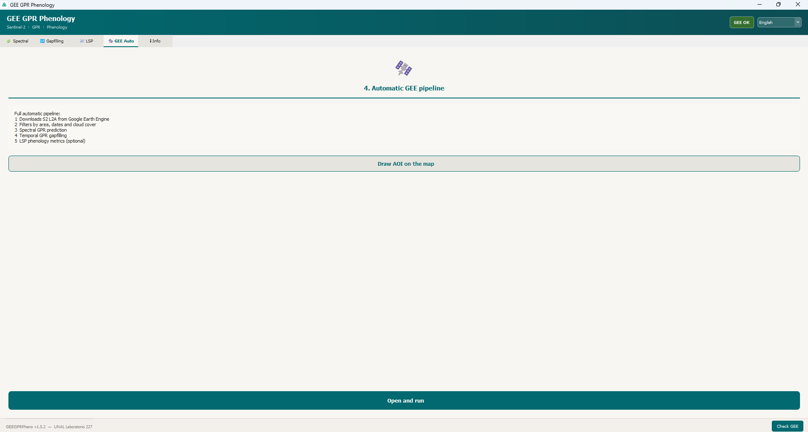
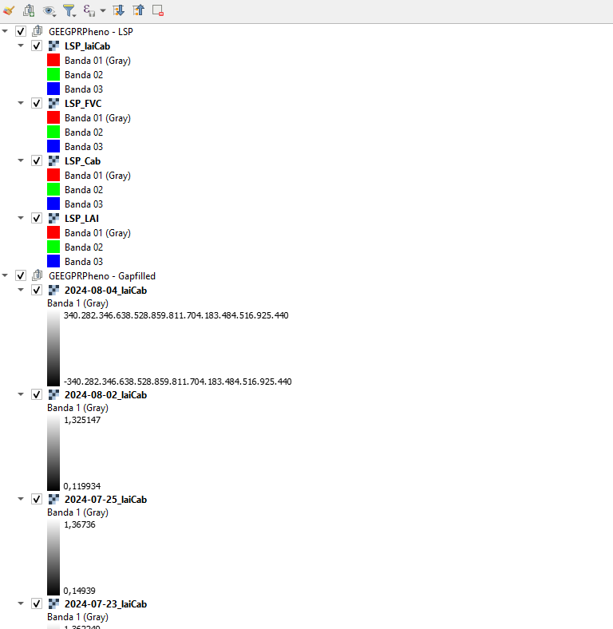
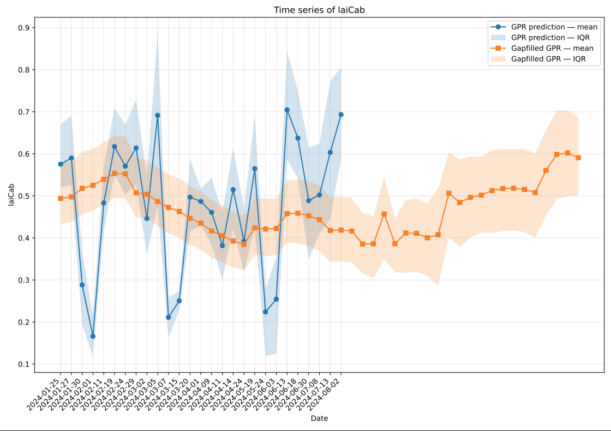
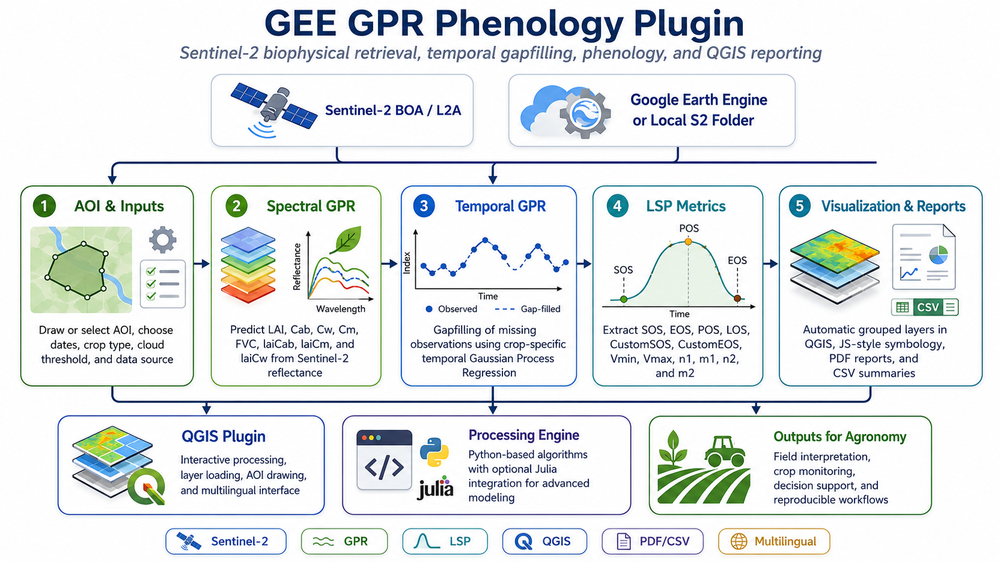

# 🛰️ GEE GPR Phenology for QGIS

<div align="center">


# GEE GPR Phenology

**A QGIS plugin for Sentinel-2 biophysical retrieval, temporal gapfilling, and land surface phenology (LSP) analysis**

[](https://qgis.org/)
[](https://www.python.org/)
[](https://dataspace.copernicus.eu/)
[](https://earthengine.google.com/)
[](#)
[](#-version-history)
[](#-license)

**Developed and adapted for QGIS from the original Google Earth Engine methodology by Salinero-Delgado et al.**

[🚀 Quick start](#-quick-start) •
[🧠 Features](#-main-features) •
[🧪 Algorithms](#-algorithms) •
[🗂️ Repository structure](#️-repository-structure) •
[📦 Installation](#-installation) •
[📄 Citation](#-citation)

</div>

---

## ✨ What is this plugin?

**GEE GPR Phenology** is a **QGIS desktop plugin** that brings a complete remote sensing workflow into a GIS-friendly environment. It estimates crop biophysical variables from **Sentinel-2 BOA/L2A** imagery using **Gaussian Process Regression (GPR)**, performs **temporal gapfilling**, derives **Land Surface Phenology (LSP)** metrics, and supports both:

- **direct downloads from Google Earth Engine (GEE)**, and
- **local Sentinel-2 BOA GeoTIFF workflows**.

The plugin was progressively improved to become a more robust, user-friendly, multilingual, and visually richer QGIS tool while preserving the mathematical foundations of the original JavaScript workflow.

---

## 🎬 README preview media

> This README is prepared so that it looks great on GitHub **as soon as you add your media files**.  
> Put your screenshots/GIFs under `docs/media/` using the names below and GitHub will render them automatically.

### Recommended media files

```text
docs/media/hero-plugin.gif
docs/media/panel-overview.png
docs/media/draw-aoi.gif
docs/media/pipeline-workflow.png
docs/media/qgis-layers-view.png
docs/media/lsp-report-preview.png
docs/media/pdf-timeseries-preview.png
```

### Hero animation

<div align="center">
  
</div>

### Visual gallery

| Plugin panel | QGIS loaded layers |
|---|---|
|  |  |

| AOI drawing tool | PDF report preview |
|---|---|
|  |  |

---

## 🌿 Main features

### Core scientific workflow

- **Spectral GPR prediction** from Sentinel-2 BOA/L2A reflectance
- **Temporal GPR gapfilling** for cloudy or missing observations
- **LSP extraction** using double logistic fitting
- **Automatic end-to-end pipeline** from AOI to final phenological metrics

### Data input options

- **Google Earth Engine** download workflow
- **Local Sentinel-2 BOA GeoTIFF folder** workflow
- AOI from **existing vector layer** or **interactive polygon drawing tool** in QGIS

### Visual and usability improvements

- automatic loading of raster outputs into QGIS
- grouped layers in the layer tree:
  - `Raw`
  - `GPR pred`
  - `Gapfilled`
  - `LSP`
- automatic symbology using palettes adapted from the **original JavaScript files**
- generation of **PDF reports** and **CSV summaries**
- multilingual interface:
  - **English** (default)
  - **Español**
  - **Português**

### Robustness improvements introduced during development

- safe dependency handling
- safer GEE authentication workflow
- support for switching GEE projects
- non-invasive plugin startup behavior
- fixed QA60/SCL cloud mask logic
- corrected GPR equations to match original `.js`
- fixed LSP raster stacking issues caused by inconsistent dimensions
- deduplication of dates and cleanup of old temporary outputs

---

## 🧠 Supported biophysical variables

| Variable | Description | Typical units |
|---|---|---|
| `LAI` | Leaf Area Index | m²/m² |
| `Cab` | Leaf chlorophyll content | µg/cm² |
| `Cw` | Leaf water content | cm |
| `Cm` | Leaf dry matter content | g/cm² |
| `FVC` | Fractional Vegetation Cover | unitless |
| `laiCab` | LAI × Cab | g/m² |
| `laiCm` | LAI × Cm | g/m² |
| `laiCw` | LAI × Cw | g/m² |

---

## 🧪 Algorithms

The plugin exposes four main algorithms through the QGIS Processing framework.

### 1) Spectral prediction GPR

**Purpose:** estimate biophysical variables pixel by pixel from Sentinel-2 BOA spectral data.

**Main file:** `algo_spectral_prediction.py`

**Inputs:**
- Sentinel-2 raster stack
- biophysical target variable
- scale factor
- optional valid mask

**Output:**
- a single-band GeoTIFF with the estimated variable

---

### 2) Temporal gapfilling GPR

**Purpose:** fill temporal gaps in the time series caused by cloud cover or missing observations.

**Main file:** `algo_gapfilling.py`

**Inputs:**
- folder of per-date prediction rasters
- target date / time window
- crop type
- variable

**Output:**
- gapfilled raster(s)

---

### 3) LSP metrics generation

**Purpose:** derive phenological metrics by fitting a double logistic function over the gapfilled time series.

**Main file:** `algo_lsp.py`

**Typical LSP outputs:**
- `SOS` — Start of Season
- `EOS` — End of Season
- `POS` — Peak of Season
- `LOS` — Length of Season
- `CustomSOS`
- `CustomEOS`
- `Vmin`
- `Vmax`
- `n1`, `m1`, `n2`, `m2`

**Output:**
- multiband GeoTIFF with 12 LSP metrics

---

### 4) Automatic GEE pipeline

**Purpose:** run the complete workflow automatically:

```text
AOI → Sentinel-2 filtering/download → Spectral GPR → Temporal gapfilling → LSP → QGIS visualization + PDF/CSV reports
```

**Main file:** `algo_gee_pipeline.py`

This is the most user-friendly entry point for the plugin.

---

## 📐 Scientific and technical basis

This plugin is based on the original **Google Earth Engine JavaScript** workflow and was adapted to QGIS/Python while preserving the core mathematical methodology.

### Spectral GPR

A Gaussian Process Regression model is applied to the reflectance vector:

```math
k(x, x') = \sigma^2 \exp\left(-\frac{1}{2}\sum_i \frac{(x_i-x_i')^2}{\ell_i^2}\right)
```

The prediction is computed from the kernel vector and the pre-trained coefficients of the model.

### Temporal GPR gapfilling

A temporal kernel is used to interpolate missing observations:

```math
K(t_i, t_j) = \sigma_f^2 \exp\left(-\frac{(t_i-t_j)^2}{2\ell_{ts}^2}\right)
```

### Double logistic phenology

A double logistic function is fitted to estimate seasonal transitions and derive LSP metrics.

---

## 🗂️ Repository structure

```text
GEE_GPR_Phenology/
├── GEEGPRPheno/
│   ├── __init__.py
│   ├── plugin.py
│   ├── processing_provider.py
│   ├── algo_spectral_prediction.py
│   ├── algo_gapfilling.py
│   ├── algo_lsp.py
│   ├── algo_gee_pipeline.py
│   ├── gpr_algorithms.py
│   ├── s2boa_models.py
│   ├── gee_palettes.py
│   ├── qgis_utils.py
│   ├── installer.py
│   ├── i18n.py
│   ├── requirements.txt
│   ├── metadata.txt
│   ├── icon.png
│   └── icon.svg
├── docs/
│   └── media/
│       ├── hero-plugin.gif
│       ├── panel-overview.png
│       ├── draw-aoi.gif
│       ├── pipeline-workflow.png
│       ├── qgis-layers-view.png
│       ├── lsp-report-preview.png
│       └── pdf-timeseries-preview.png
├── README.md
├── LICENSE
└── CHANGELOG.md
```

---

## 🌍 Workflow overview

<div align="center">
  
</div>

### End-to-end workflow

1. Define or draw an **AOI** in QGIS.
2. Choose the **data source**:
   - Google Earth Engine, or
   - local Sentinel-2 BOA folder.
3. Select the **biophysical variable** and **crop type**.
4. Run **spectral GPR**.
5. Run **temporal gapfilling**.
6. Optionally compute **LSP metrics**.
7. Load outputs automatically into QGIS.
8. Export **PDF reports** and **CSV summaries**.

---

## 🗃️ Output folders

A typical automatic pipeline run generates:

```text
output_folder/
├── 01_S2_raw/
├── 02_<variable>_pred/
├── 03_<variable>_gapfilled/
├── 04_<variable>_LSP/
└── 05_reportes_pdf/
    ├── reporte_resumen_<variable>.pdf
    ├── atlas_LSP_<variable>.pdf
    └── resumen_series_<variable>.csv
```

### Output content

| Folder | Content |
|---|---|
| `01_S2_raw` | downloaded or copied Sentinel-2 BOA scenes |
| `02_*_pred` | biophysical variable estimated by spectral GPR |
| `03_*_gapfilled` | temporally completed GPR series |
| `04_*_LSP` | phenological metrics raster |
| `05_reportes_pdf` | PDF reports and CSV summaries |

---

## 🎨 Symbology and palettes

One of the improvements of the latest versions is the use of **automatic QGIS symbology** based on the original **JavaScript visualization palettes**.

### Current visual behavior

- raw Sentinel-2 images can be displayed in **RGB natural color**
- GPR outputs use variable-specific palettes
- LSP layers use phenology-oriented palettes
- generated PDF maps reuse the same visualization logic

### Palette source

The QGIS palettes were adapted from the original `.js` files, especially:

- `visualization.js`
- `LSPGeneration.js`

and centralized into:

- `gee_palettes.py`

---

## 🌐 Multilingual interface

The plugin supports three languages:

- **English** (default)
- **Spanish**
- **Portuguese**

The active language affects:

- the plugin interface
- visible labels and tool text
- report text in generated PDF files
- some status and feedback messages

> Default language is **English**, but users can switch languages from the plugin menu.

---

## 📦 Installation

### Option A — Manual ZIP installation in QGIS

1. Open **QGIS**.
2. Go to **Plugins → Manage and Install Plugins → Install from ZIP**.
3. Select the plugin ZIP package.
4. Enable the plugin.

### Option B — Install from source

Clone the repository and copy the plugin folder into your QGIS plugins directory.

```bash
git clone https://github.com/your-user/GEE_GPR_Phenology.git
```

Then copy the `GEEGPRPheno` folder to:

| Platform | QGIS plugin folder |
|---|---|
| Windows | `C:\Users\<user>\AppData\Roaming\QGIS\QGIS3\profiles\default\python\plugins\` |
| Linux | `~/.local/share/QGIS/QGIS3/profiles/default/python/plugins/` |
| macOS | `~/Library/Application Support/QGIS/QGIS3/profiles/default/python/plugins/` |

---

## 🧰 Python dependencies

Main dependencies include:

```text
numpy
rasterio
earthengine-api   (only required for the GEE workflow)
```

Depending on the environment, additional standard scientific or plotting dependencies may be used for reports.

---

## 🚀 Quick start

### Typical use in QGIS

1. Open the plugin panel.
2. Draw or select your AOI.
3. Choose **GEE Automatic Pipeline**.
4. Set:
   - start date
   - end date
   - cloud threshold
   - variable
   - crop type
   - LSP on/off
5. Run the algorithm.
6. Visualize the grouped outputs in QGIS.
7. Review the generated PDF reports.

---

## 🔐 Google Earth Engine authentication

The plugin supports GEE authentication and project switching.

### Recommended workflow

- authenticate once from the plugin menu
- select or update the GEE project
- rerun the pipeline

### Also supported

- service account JSON credentials
- saved Earth Engine credentials
- local-only mode without GEE

---

## 🖥️ User interface overview

The plugin was designed to keep the workflow accessible to users who prefer a GUI rather than writing scripts manually.

### Main UI concepts

- floating panel
- algorithm tabs
- processing integration
- AOI drawing tool
- dependency installation helper
- multilingual selection

<details>
<summary><strong>Suggested screenshot captions for the README</strong></summary>

- **Figure 1.** Main plugin panel with algorithm tabs.  
- **Figure 2.** AOI polygon drawing directly on the QGIS canvas.  
- **Figure 3.** Automatic grouping of output layers in the QGIS Layer Panel.  
- **Figure 4.** Example PDF report page showing temporal series and summary maps.  
- **Figure 5.** Example LSP metric atlas generated by the plugin.

</details>

---

## 📊 Generated reports

The plugin can generate publication-friendly report files directly from the analysis.

### PDF outputs

- summary report of the selected variable
- temporal series plots
- summary raster maps
- LSP atlas report

### CSV outputs

- date-wise summary table
- valid pixel counts
- mean
- median
- standard deviation
- quartiles
- min / max

---

## 🛠️ Development history and major fixes

This QGIS plugin was not produced in a single step. It was improved iteratively to solve real-world issues encountered during testing.

### Main milestones

- **v1.1.x** — initial integration and alternative local S2 input
- **v1.2.x** — mathematical validation against the original JavaScript workflow
- **v1.3.x** — stability fixes, AOI drawing tool, QA60 logic correction
- **v1.4.0** — better loading of outputs in QGIS and PDF reporting
- **v1.5.0** — multilingual support, grouped outputs, improved LSP robustness
- **v1.5.1** — English as default language and multilingual PDF text
- **v1.5.2** — original JavaScript-based palettes for QGIS layers and PDF visualization

---

## 🧪 Validation philosophy

Special effort was made to ensure that the QGIS implementation remained faithful to the original methodology.

### Validation areas

- equivalence of spectral GPR logic
- temporal GPR gapfilling consistency
- stable handling of Sentinel-2 cloud masking
- robustness of raster stacking for LSP
- correct handling of multilingual visible text
- consistency of visualization palettes with original `.js` files

---

## ⚠️ Troubleshooting

### Common issues

#### 1. Earth Engine dependency loop
Use the controlled dependency installation workflow instead of attempting installation automatically on every startup.

#### 2. QA60 not found
Some Sentinel-2 assets may not expose `QA60`. The plugin now falls back safely to `SCL`-based masking.

#### 3. LSP stack shape mismatch
Older runs could mix rasters with slightly different dimensions. Newer versions clean or harmonize rasters before stacking.

#### 4. Plugin opens too aggressively
This behavior was fixed. The plugin should not auto-open invasively at QGIS startup.

---

## 🧭 Roadmap

Possible future developments include:

- Julia-backed extensions for advanced numerical modules
- more report templates
- richer QGIS style presets
- official plugin repository packaging
- automated tests and CI/CD
- more crop-specific calibration options
- improved batch processing tools

---

## 🤝 Acknowledgements

This work builds on the original remote sensing methodology and demonstration workflows developed by **Salinero-Delgado et al.** in Google Earth Engine.

It was later adapted, validated, and expanded into a QGIS plugin environment with a strong focus on:

- usability
- reproducibility
- mathematical consistency
- desktop GIS integration

---

## 📄 Citation

If you use this plugin in research, technical reports, or teaching, please cite both the plugin and the original methodology.

### Suggested citation for the plugin

```text
Flores Riera, J. E., and collaborators. GEE GPR Phenology for QGIS: a plugin for Sentinel-2 biophysical retrieval, temporal gapfilling, and land surface phenology analysis. Version 1.5.2.
```

### Original methodological basis

```text
Salinero-Delgado, M., et al. GEE GPR Phenology demos and associated methodology for Sentinel-2 time-series analysis.
```

> Replace the citation text above with the final formal bibliographic reference you prefer for the repository.

---

## 👨‍💻 Authors and contact

**Primary plugin adaptation and development**  
Jesús Enrique Flores Riera  
Laboratorio 227 — Universidad Nacional de Colombia  

**Project support / scientific and technical improvement workflow**  
Collaborative iterative development for robust QGIS deployment, model validation, visualization, and multilingual support.

---

## 📜 License

This repository can be distributed under the **MIT License** unless you decide to use another final license.

Add a `LICENSE` file at the root of the repository.

---

## ⭐ Final note

If this plugin is useful for your research or technical work:

- give the repository a **star** ⭐
- cite it in your publications
- open issues for bugs or feature requests
- share screenshots, examples, and use cases

<div align="center">

**Made for robust crop monitoring workflows in QGIS** 🌾🛰️📈

</div>
